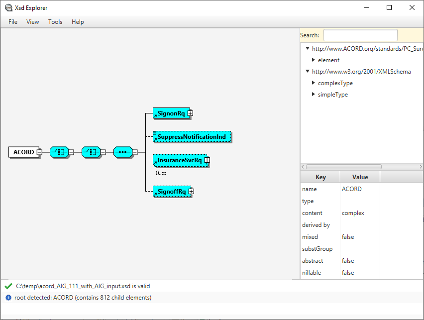

# Xsd Explorer
XML schema visualization utility with XMLSpy like view of schema structure.

See [Xsd Explorer](https://xsdexplorer.com/) for more information

## Download for Windows x64:
Latest release [xsdexplorer-windows_x64.zip](https://github.com/tadamovsky/xsdexplorer/releases/latest/download/xsdexplorer-windows_x64.zip) - Portable version, extract to any directory and start via XsdExplorer.exe

## For Linux users (without bundled java runtime)
Latest release [xsdexplorer-no_jdk.zip](https://github.com/tadamovsky/xsdexplorer/releases/latest/download/xsdexplorer-no_jdk.zip) - Java 17+ with JavaFx must be used to run it (see how2run.txt) 
